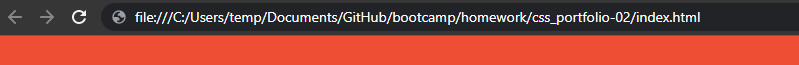
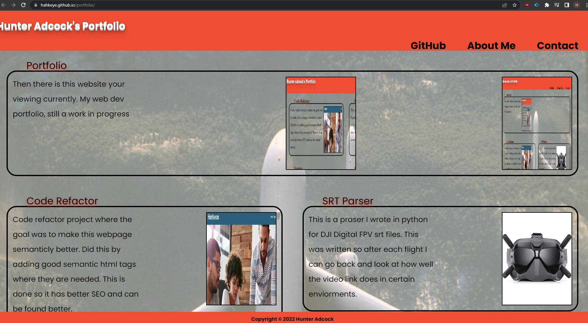

# CSS Portfolio

## Description

This is my Web Dev portfolio. It contains basics of Html, CSS and soon to be other things. It is meant to demostrate profeciceny in the arts of Web dev.

## Table Of Cotents

- [Installation And Usage](#installation)
- [Techniques](#techniques)
- [Git Pages](#pages)

## Installation
To get this up and runing simply download the repo. Extract and navigate your browser to the location of the index.html.

## Techniques
Several things done in this page include FlexBox, Flex, Google fonts and all around a reactive webpage desgin.

[FlexBox Guide](https://css-tricks.com/snippets/css/a-guide-to-flexbox/)

[Mozilla Documentation on Flexbox](https://developer.mozilla.org/en-US/docs/Web/CSS/CSS_Flexible_Box_Layout/Basic_Concepts_of_Flexbox)

[Mozzilla semantics resources.](https://developer.mozilla.org/en-US/docs/Web/HTML/Element)

## Pages

If you would like to view this live. Github has this great utility called Gitpages where you can host stuff.
If you click [here](https://hahkeye.github.io/portfolio/)
